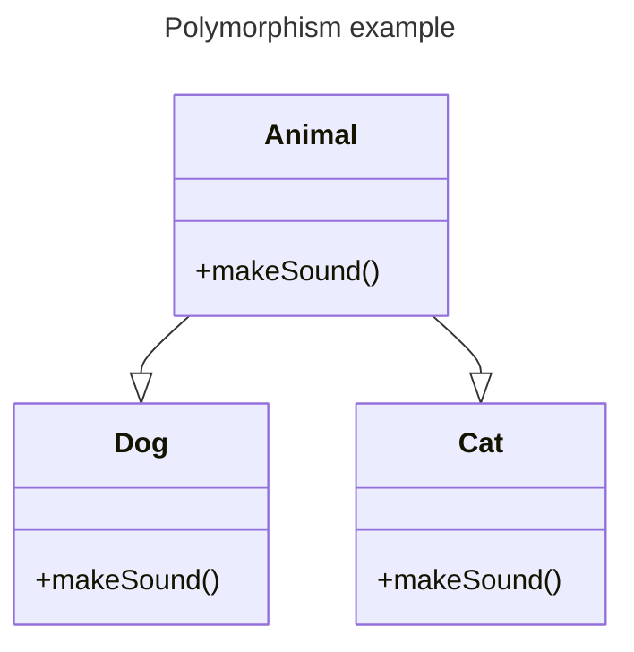

# OOP
OOP Stands for Object Oriented Programming
### What is OOP?
Object-oriented programming has several advantages over procedural programming
<br>
`OOP - is faster and easier to execute`
<br>
`OOP - provides a clear structure for the programs`
<br>
`OOP - helps to keep the Java code DRY "Don't Repeat Yourself", and makes the code easier to maintain, modify and debug`
<br>
`OOP - makes it possible to create full reusable applications with less code and shorter development time`

# The 4 core basics concepts of OOP
> Encapsulation
```
The idea behind encapsulation is to ensure that implementation details are not visible to users. 
The variables of one class will be hidden from the other classes, accessible only through the methods of the current class. 
This is called data hiding.
```
> Inheritance
```
Inheritance is the process that enables one class to acquire the properties (methods and variables) of another. 
With inheritance, the information is placed in a more manageable, hierarchical order.
```
> Polymorphism
```
which refers to the idea of "having many forms", occurs when there is a hierarchy of classes 
related to each other through inheritance.
```
> Abstraction
```
Data abstraction provides the outside world with only essential information, 
in a process of representing essential features without including implementation details.
```
## other concepts

> Association

> Aggregation

> Composition


## More

Interface & Implementation

## reference

https://www.w3schools.com/java/
<br>
https://sololearn.com


## diagram



